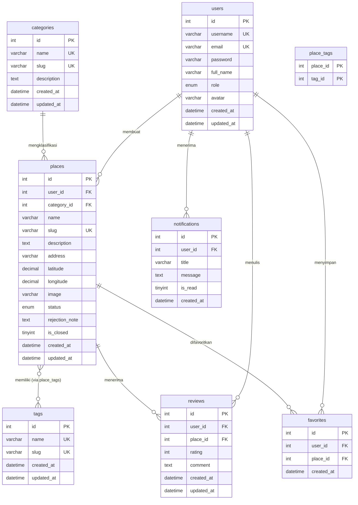
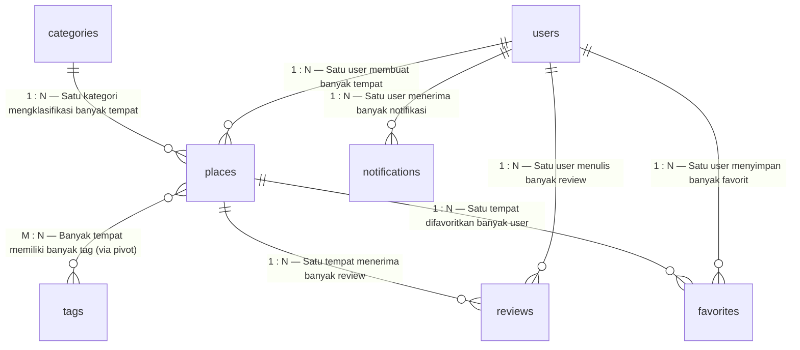
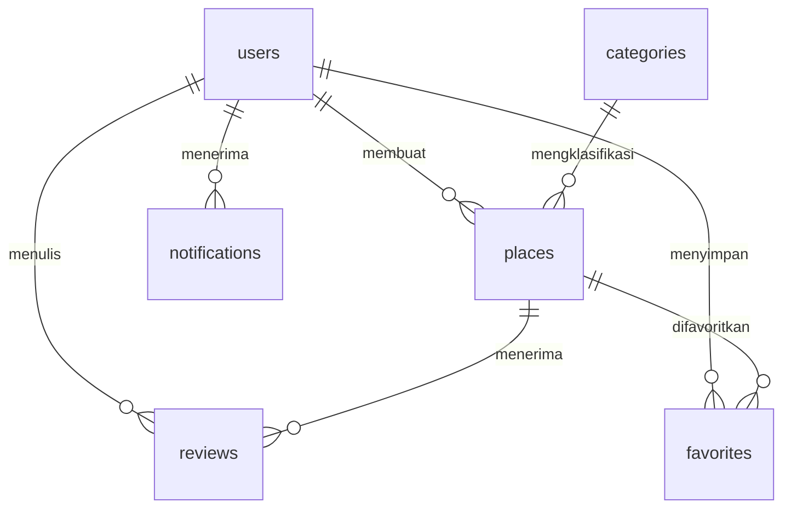
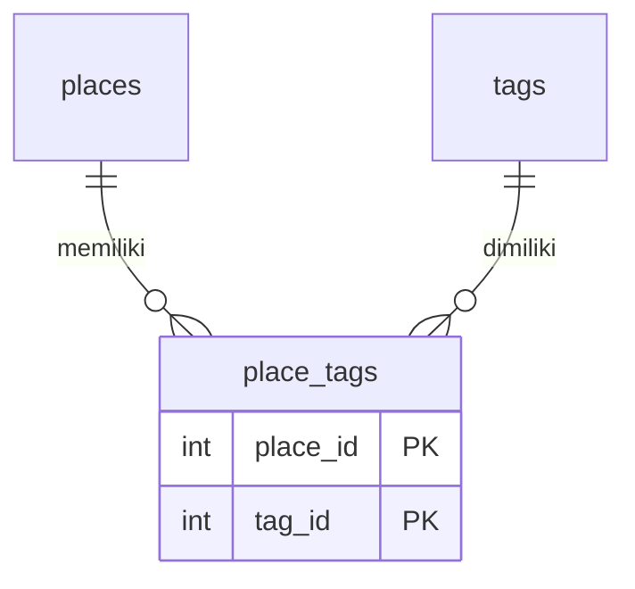
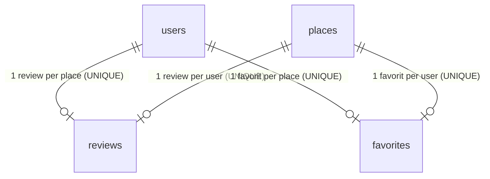

# Mermaid ERD — KulinerReview

Copy dan paste kode di bawah ke tool/editor yang mendukung Mermaid diagram (GitHub Markdown, Mermaid Live Editor, Notion, dsb.).

---

## 3.1 ERD Lengkap

---

## 3.2 Ringkasan Kardinalitas

---

## 3.3 Detail Relasi

### One-to-Many (1:N)

### Many-to-Many (M:N) — dengan Pivot Table

### One-to-One — Kontekstual (via UNIQUE Constraint)

---

## 3.4 Penjelasan Notasi Mermaid

| Simbol Mermaid | Makna | Contoh |
|:---:|---|:---:|
| `||` | **Satu** (One) — tepat satu record | Satu user |
| `o{` atau `}|` | **Banyak** (Many) — nol atau lebih | Banyak tempat |
| `||--o{` | **One-to-Many (1:N)** | `users ||--o{ places` |
| `}o--o{` | **Many-to-Many (M:N)** | `places }o--o{ tags` |
| `||--o|` | **One-to-One (1:1)** | `users ||--o| reviews` (per place) |
| `PK` | Primary Key | `int id PK` |
| `FK` | Foreign Key | `int user_id FK` |
| `UK` | Unique Key | `varchar email UK` |

---

> **Catatan:** Relasi Many-to-Many di Mermaid tidak bisa langsung ditulis `places }o--o{ tags` tanpa tabel pivot. Implementasi fisiknya menggunakan tabel `place_tags` sebagai junction table.
